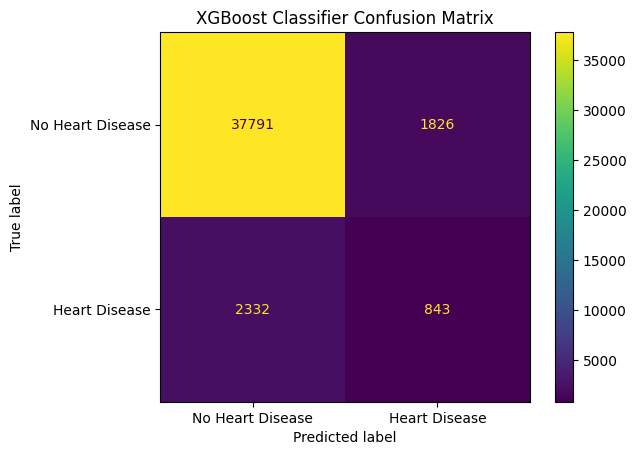
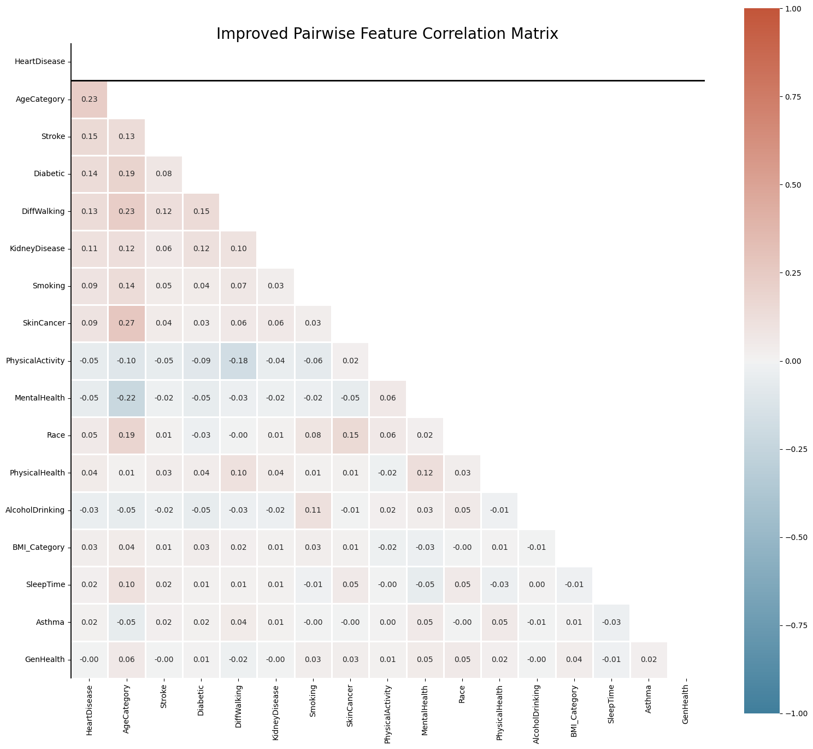

# Auditing a Heart Disease Prediction Model

A 90%-accurate model can still miss most of the people it exists to catch. This project is a
technical audit of a public heart-disease classifier: an XGBoost model trained on 320K CDC health
survey responses. We checked how well it finds the patients who matter, whether its errors fall
evenly across sex and race, and how its decision threshold should change for screening.

NYU, Responsible Data Science, May 2025. A two-person audit by Ryan Cho and Yuchun (Austin) Wu.
Full write-up: [RDS_Project_Final copy.pdf](RDS_Project_Final%20copy.pdf).

## Findings

| Question | Finding |
|---|---|
| Does accuracy tell the story? | No. Accuracy is 90.3%, but the model catches only **27% of actual heart-disease cases** (recall 0.27, precision 0.32). |
| Does it hold up on hard cases? | On borderline predictions (probability 0.4–0.6, 1,565 patients) accuracy falls to **54%**, barely better than a coin flip. |
| Is it fair across sexes? | Yes. False-negative rates are almost identical (0.74 male, 0.73 female), as are AUC values (0.80 and 0.81). |
| Is it fair across race? | Less so. Predictive parity ranges from **26% (Asian) to 41% (American Indian / Alaskan Native)**, so a positive prediction is less reliable for some groups. White and Asian patients have the highest false-negative rates. |
| Can the threshold be fixed for screening? | Yes. Weighting missed cases 3:1 over false alarms gives an optimal threshold of **0.10**, lifting sensitivity from **27% to 64%** at 80% specificity. |



The confusion matrix is the whole story in one picture: of 3,175 people with heart disease in the
test set, the model labels 2,332 as healthy.

### Fairness by race (XGBoost, default threshold)

| | White | Black | Asian | Hispanic | Am. Indian / Alaskan Native | Other |
|---|---|---|---|---|---|---|
| False-negative rate | 0.74 | 0.70 | 0.75 | 0.72 | 0.69 | 0.70 |
| Predictive parity | 0.31 | 0.36 | 0.26 | 0.32 | 0.41 | 0.38 |
| AUC | 0.81 | 0.81 | 0.78 | 0.78 | 0.81 | 0.80 |

We chose false-negative rate (equal opportunity) and predictive parity as the fairness metrics because,
in screening, a missed diagnosis delays treatment, and a positive prediction should mean the same thing
for every patient.

## What was audited

The system under audit is a public Kaggle notebook,
[Heart Disease Prediction — ML Acc 90](https://www.kaggle.com/code/ebrahimmerza/heart-disease-prediction-ml-acc-90)
by Ebrahim Merza, trained on the
[Personal Key Indicators of Heart Disease](https://www.kaggle.com/datasets/kamilpytlak/personal-key-indicators-of-heart-disease)
dataset: the CDC's 2020 BRFSS telephone survey, 319,795 responses and 18 features (age, BMI, smoking,
stroke, diabetes, general health, race, sex and more).

Its pipeline: IQR outlier removal, BMI binned into clinical categories, ordinal and one-hot encoding,
standard scaling, SMOTEENN resampling for the 9:1 class imbalance, then five models. XGBoost scored
highest and is the one we audited.

| Model | Accuracy |
|---|---|
| XGBoost | 90.3% |
| LightGBM | 90.2% |
| Random Forest | 88.2% |
| Gradient Boosting | 86% |
| Logistic Regression | 74.7% |



Age is the strongest single predictor (r = 0.23), followed by stroke history, diabetes, difficulty
walking and kidney disease. Most feature pairs barely correlate (|r| < 0.10), so multicollinearity
isn't a concern.

## Our additions

In [RDS_Project_Code copy.ipynb](RDS_Project_Code%20copy.ipynb), the sections up to the XGBoost model,
plus LightGBM, reproduce the original system. Our audit adds:

1. **Pairwise correlation analysis** of all encoded features against the target.
2. **Accuracy across subgroups:** recall, F1 and AUC by sex and by race.
3. **Fairness metrics:** false-negative rate, true-positive rate and predictive parity by sex and race.
4. **Decision-boundary analysis:** how the model performs on its most uncertain predictions.
5. **Clinical threshold optimization:** a 3:1 sensitivity-weighted utility to choose a screening
   threshold.

## Conclusion

The model is well suited to ruling heart disease *out*, and poorly suited to finding it. We wouldn't
deploy it on its own. It could support screening only with a lowered threshold, a second model to
recover missed cases, and monitoring of the gaps between racial groups.

## Running it

The notebook was written for Kaggle, where the dataset is mounted at
`/kaggle/input/personal-key-indicators-of-heart-disease/`. To run it elsewhere, download the dataset
from Kaggle and point the `read_csv` path at `heart_2020_cleaned.csv`.

```bash
pip install pandas numpy scikit-learn xgboost lightgbm imbalanced-learn seaborn matplotlib
```

## Stack

Python · pandas · scikit-learn · XGBoost · LightGBM · imbalanced-learn · seaborn · Matplotlib
